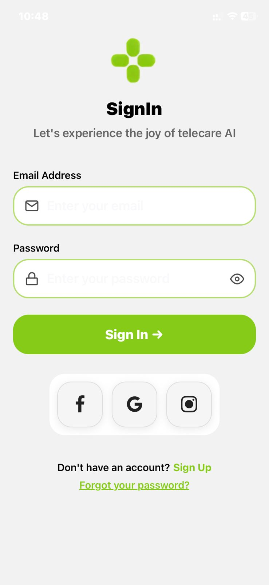

# SignIn Page UI

A clean and modern sign-in page built with Expo and React Native.

## Features

- **Email & Password Input Fields** - Styled input fields with icon indicators
- **Password Visibility Toggle** - Show/hide password functionality
- **Social Login Buttons** - Quick sign-in via Facebook, Google, and Instagram
- **Modern Design** - Green-themed UI with rounded borders and smooth interactions
- **Mobile Responsive** - Optimized for all device sizes

## UI Preview



## Installation

```bash
npm install
```

## Running the App

```bash
npx expo start
```

Choose your preferred platform:
- Android emulator
- iOS simulator
- Expo Go app

## Project Structure

- `app/index.tsx` - Main sign-in page component
- `components/SocialsButtons.tsx` - Reusable social login buttons component

## Dependencies

- [React Native](https://reactnative.dev/)
- [Expo](https://expo.dev/)
- [Expo Vector Icons](https://docs.expo.dev/guides/icons/)
